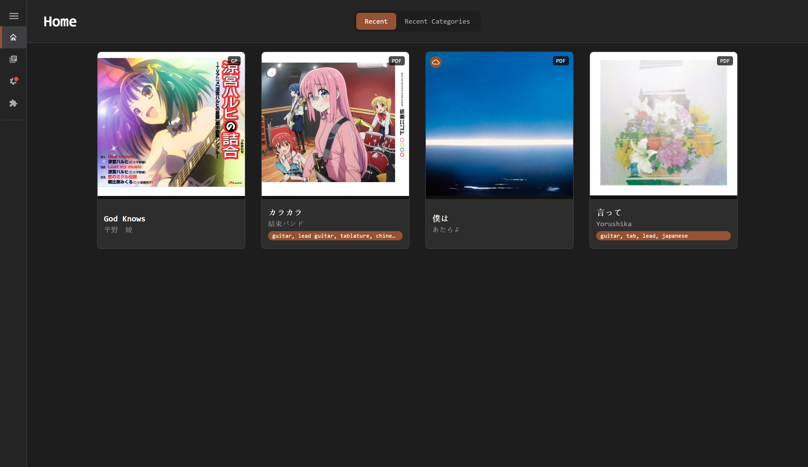
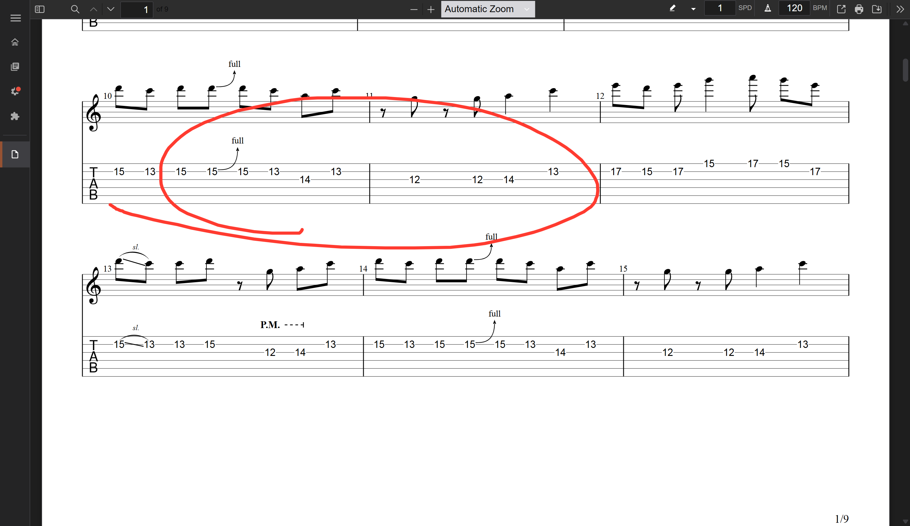
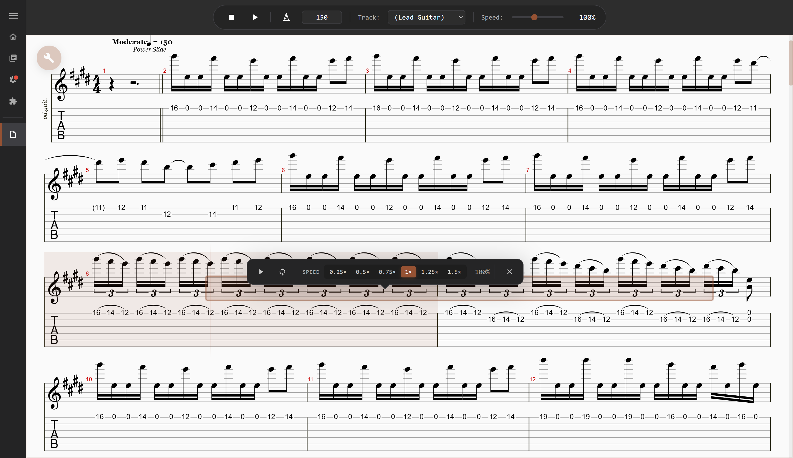
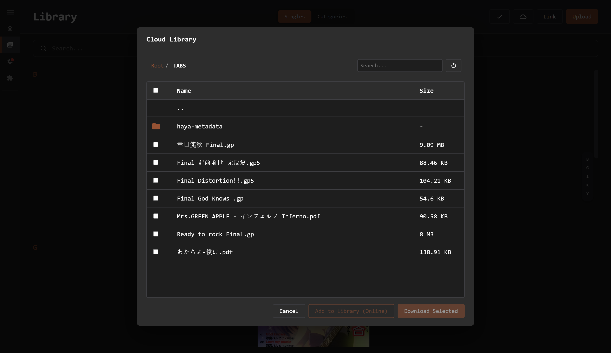

# HAYA-TAB

Organize, read, play, and sync your music tabs from one lightweight desktop app.


[](https://github.com/HAYASAKA7/HAYA-TAB/releases/latest)
[](LICENSE)

**[Download the latest release →](https://github.com/HAYASAKA7/HAYA-TAB/releases/latest)**

<p align="center">
  
</p>

HAYA-TAB helps musicians:

- Keep PDF, Guitar Pro, and MusicXML files in one searchable library.
- Practice without leaving the app using built-in PDF and AlphaTab viewers.
- Carry the same organized library between computers through WebDAV.

## See HAYA-TAB in action

### Read, annotate, and perform

Open PDFs inside HAYA-TAB, use hands-free auto-scroll, and add pen or highlighter
notes on a non-destructive layer that leaves the original score untouched.

Open Guitar Pro and MusicXML files with AlphaTab to view notation, play parts,
loop sections, and adjust playback speed while you practice.

<table>
  <tr>
    <td width="50%">
      
    </td>
    <td width="50%">
      
    </td>
  </tr>
  <tr>
    <td align="center"><strong>PDF reading and annotations</strong></td>
    <td align="center"><strong>AlphaTab playback and looping</strong></td>
  </tr>
</table>

### Keep your cloud library close

Connect a WebDAV server to discover cloud volumes, browse remote tabs, stream
files on demand, and download the pieces you want available offline. HAYA-TAB
preserves metadata and category organization across computers.

<p align="center">
  
</p>

## Supported formats

| Format | Extensions | Built-in experience |
| --- | --- | --- |
| PDF | `.pdf` | Reader, auto-scroll, and non-destructive annotations |
| Guitar Pro | `.gp`, `.gp5`, `.gpx` | Notation, playback, looping, section playback, and speed control |
| MusicXML | `.xml`, `.musicxml`, `.mxl` | Notation and playback through AlphaTab |

## What you can do

- **Organize** — Upload files or link them in place, group tabs into categories,
  add part/version tags, search titles, artists, and albums, and manage multiple
  tabs in a batch.
- **Practice** — Read and annotate PDFs, play Guitar Pro and MusicXML scores,
  loop sections, change speed, use auto-scroll, and map viewer actions to a MIDI
  foot controller.
- **Sync** — Watch local folders for new files and use WebDAV volumes for
  multi-computer access, on-demand cloud files, uploads, and lightweight
  annotation sync.
- **Customize** — Choose light or dark themes, configure key bindings and
  storage locations, use English, Simplified or Traditional Chinese, or
  Japanese, and extend metadata workflows with JavaScript plugins.

## Quick start

1. **Add music:** Right-click empty library space and choose **Upload TAB** or
   **Link Local TAB**.
2. **Organize it:** Create categories, edit metadata, and add part or version
   tags.
3. **Bring in folders:** Add sync paths in Settings to import supported files
   automatically.
4. **Connect your cloud:** Configure WebDAV in Settings to browse and sync a
   remote library. See the [WebDAV guide](docs/WEBDAV.md).
5. **Start practicing:** Open a tab normally or choose **Open with Inner
   Viewer** for PDF and AlphaTab practice tools.

## Installation

Download the current build for your operating system from
[GitHub Releases](https://github.com/HAYASAKA7/HAYA-TAB/releases/latest).

<details>
<summary>macOS reports that HAYA-TAB cannot be verified or is damaged</summary>

HAYA-TAB is not currently signed with an Apple Developer certificate.

1. Open **System Settings → Privacy & Security**.
2. Find the blocked HAYA-TAB launch and select **Open Anyway**.
3. If macOS still blocks the app after you move it into `/Applications`, run:

   ```bash
   xattr -cr /Applications/HAYA-TAB.app
   ```

</details>

## Documentation

- [Development guide](docs/DEVELOPMENT.md)
- [Mobile development guide](docs/MOBILE_DEVELOPMENT.md) — experimental
- [Architecture overview](docs/ARCHITECTURE.md)
- [Contributing guidelines](docs/CONTRIBUTING.md)
- [WebDAV guide](docs/WEBDAV.md)

## License

HAYA-TAB is available under the [Apache License 2.0](LICENSE). See
[NOTICE](NOTICE) for attribution information.

## Author

**HAYASAKA7** — [cyanluxury267@gmail.com](mailto:cyanluxury267@gmail.com)
